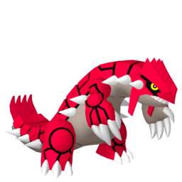

<div align="center">
  

  <h1>Groudon</h1>

  <p><strong>Shared typography styles for the Charizard design system — one CSS file, every zap-* class.</strong></p>

  <p>
    <a href="https://www.npmjs.com/package/@hybr1d-tech/groudon"></a>
    
    
  </p>

  <p>
    <a href="#installation">Installation</a> ·
    <a href="#usage">Usage</a> ·
    <a href="#type-scale">Type scale</a> ·
    <a href="#development">Development</a>
  </p>
</div>

---

Groudon is the shared typography layer used across ZenAdmin's product surfaces alongside [Charizard](https://github.com/Usehybrid/charizard), the React component library. It ships a single minified stylesheet of `zap-*` utility classes (Instrument Sans, rem-based scale) so every app renders text identically.

## Installation

```bash
pnpm add @hybr1d-tech/groudon
```

## Usage

Import the stylesheet once at your app's entry point:

```ts
import '@hybr1d-tech/groudon'
```

Then apply the `zap-*` classes (typically via `clsx` next to your CSS-module classes):

```tsx
<h1 className={clsx(classes.heading, 'zap-hero-semibold')}>Page title</h1>
<p className="zap-content-regular">Body copy</p>
```

The package's `main` points at `dist/typography.min.css`, so most bundlers resolve the bare import to the stylesheet directly.

## Type scale

Each level comes in `medium` (500), `semibold` (600), and `bold` (700) weights:

| Level      | Class prefix      | Size | Use for                           |
| ---------- | ----------------- | ---- | --------------------------------- |
| Hero       | `zap-hero-*`      | 20px | Page headings, prominent values   |
| Lead       | `zap-lead-*`      | 18px | Section titles                    |
| Heading    | `zap-heading-*`   | 16px | Card titles, item names           |
| Content    | `zap-content-*`   | 14px | Body text, values, form labels    |
| Subcontent | `zap-subcontent-*`| 12px | Secondary/meta text, small CTAs   |
| Caption    | `zap-caption-*`   | 11px | Uppercase micro-labels            |

Sizes are authored in `rem` against a `--base-font-size` of 16px, so they scale with the root font size. See [`conversion-guide.md`](conversion-guide.md) for mapping design-file styles to classes.

## Development

The source of truth is [`styles/typography.css`](styles/typography.css); the published file is built with PostCSS + cssnano:

```bash
pnpm install
pnpm build   # postcss styles/typography.css -o dist/typography.min.css
```

`prepublishOnly` runs the build automatically, so publishing is just `npm publish` after a version bump.

---

<div align="center">
  <sub>Groudon artwork © Nintendo / Creatures Inc. / GAME FREAK inc. Used as a mascot for this fan-named project.</sub>
</div>
